# Práctica: Servidor Web Nginx
## Muestra al profesor: Tarea 4, Tarea 9

**Tarea 1: Crea un escenario Vagrant o utiliza una máquina del cloud con una red pública. Instala el servidor web nginx en la máquina. Modifica la página index.html que viene por defecto y accede a ella desde un navegador. Entrega una captura de pantalla accediendo a ella.**

[Máquina_servidor_gnix](https://github.com/PalomaR88/Servidor_web_gninx/blob/master/Vagrantfile "Máquina Debian Buster con Vagrant")

Actualización de la máquina.
~~~
vagrant@servidornginx:~$ sudo apt update
~~~

Instalación de Nginx:
~~~
vagrant@servidornginx:~$ sudo apt install nginx
~~~

Se observa la dirección del root de /etc/nginx/sites-available/default:
~~~
        root /var/www/html;
~~~

Y se accede al index.html de esa ruta para modificarlo:
~~~
<!DOCTYPE html>
<html>
<head>
<title>Welcome to nginx!</title>

</head>
<body>
<h1>Sitio web de Paloma</h1>

Práctica de Nginx

For online documentation and support please refer to
<a href="http://nginx.org/">nginx.org</a>. 
Commercial support is available at
<a href="http://nginx.com/">nginx.com</a>.

<em>Thank you for using nginx.</em>

</body>
</html>
~~~

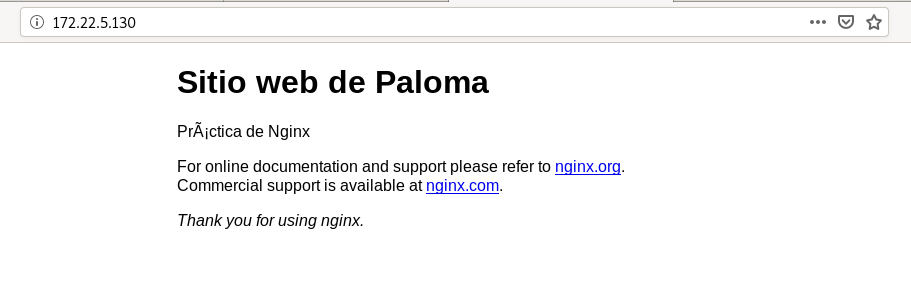

## Virtual Hosting
Queremos que nuestro servidor web ofrezca dos sitios web, teniendo en cuenta lo siguiente:
- Cada sitio web tendrá nombres distintos.
- Cada sitio web compartirán la misma dirección IP y el mismo puerto (80).

Los dos sitios web tendrán las siguientes características:

- El nombre de dominio del primero será www.iesgn.org, su directorio base será /srv/www/iesgn y contendrá una página llamada index.html, donde sólo se verá una bienvenida a la página del Instituto Gonzalo Nazareno.
- En el segundo sitio vamos a crear una página donde se pondrán noticias por parte de los departamento, el nombre de este sitio será departamentos.iesgn.org, y su directorio base será /srv/www/departamentos. En este sitio sólo tendremos una página inicial index.html, dando la bienvenida a la página de los departamentos del instituto.

**Tarea 2: Configura la resolución estática en los clientes y muestra el acceso a cada una de las páginas.**
Se copia el fichero default:
~~~
vagrant@servidornginx:/etc/nginx/sites-available$ sudo cp default iesgn
vagrant@servidornginx:/etc/nginx/sites-available$ sudo cp default departamentos
~~~

Se modifica /etc/nginx/sites-available/iesgn:
~~~
server {
        listen 80;
        listen [::]:80;

        root /srv/www/iesgn;

        index index.html index.htm index.nginx-debian.html;

        server_name www.iesgn.org;

        location / {
                try_files $uri $uri/ =404;
        }
}
~~~

Se modifica /etc/nginx/sites-available/departamentos:
~~~
server {
        listen 80;
        listen [::]:80;

        root /srv/www/departamentos;

        # Add index.php to the list if you are using PHP
        index index.html index.htm index.nginx-debian.html;

        server_name departamentos.iesgn.org;

        location / {
                try_files $uri $uri/ =404;
        }
}
~~~

Además, se crean los enlaces simbólicos en sites-enabled:
~~~
vagrant@servidornginx:/etc/nginx/sites-enabled$ sudo ln -s /etc/nginx/sites-available/iesgn .
vagrant@servidornginx:/etc/nginx/sites-enabled$ sudo ln -s /etc/nginx/sites-available/departamentos .
~~~

Se modifican los permisos:
~~~
vagrant@servidornginx:/etc/nginx/sites-available$ sudo chown -R www-data:www-data /srv/www
~~~

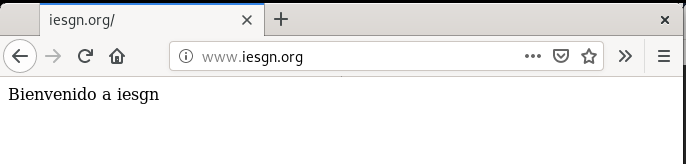
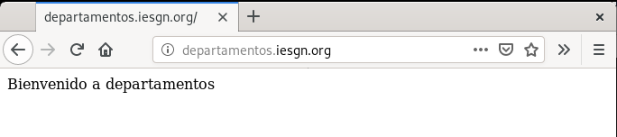

## Mapeo de URL
Cambia la configuración del sitio web www.iesgn.org para que se comporte de la siguiente forma:

**Tarea 3: Cuando se entre a la dirección www.iesgn.org se redireccionará automáticamente a www.iesgn.org/principal, donde se mostrará el mensaje de bienvenida. En el directorio principal no se permite ver la lista de los ficheros, no se permite que se siga los enlaces simbólicos y no se permite negociación de contenido. Muestra al profesor el funcionamiento.**

Se crea el directorio principal y se cambian los propietarios:
~~~
vagrant@servidornginx:/srv/www/iesgn$ sudo mkdir principal
vagrant@servidornginx:/srv/www/iesgn$ sudo chown www-data:www-data principal/
~~~

Y se modifica el fichero /etc/nginx/sites-available/iesgn para añadir la redirección:
~~~
server {
        listen 80;
        listen [::]:80;

        root /srv/www/iesgn;

        index index.html index.htm index.nginx-debian.html;

        server_name www.iesgn.org;

        location / {
                return 301 http://www.iesgn.org/principal;
        }
        location /principal {
                try_files $uri $uri/ =404;
        }
}
~~~

Se mueve el index.html al nuevo directorio principal:
~~~
vagrant@servidornginx:/srv/www/iesgn$ mv index.html principal/
~~~

Por último, se restaura el servicio de Nginx para que se efectúen los cambios:
~~~
vagrant@servidornginx:/srv/www/iesgn$ sudo systemctl restart nginx.service 
~~~

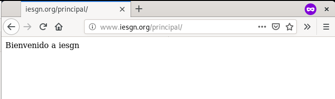

**Tarea 4: Si accedes a la página www.iesgn.org/principal/documentos se visualizarán los documentos que hay en /srv/doc. Por lo tanto se permitirá el listado de fichero y el seguimiento de enlaces simbólicos siempre que sean a ficheros o directorios cuyo dueño sea el usuario. Muestra al profesor el funcionamiento.**
Se añaden los cambios en /etc/nginx/sites-available/iesgn con un alias:
~~~
        location /principal/documentos {
                try_files $uri $uri/ =404;
                alias /srv/doc;
                autoindex on;
                disable_symlinks if_not_owner;
        }
~~~

Se crea el directorio doc y se cambia el propietario:
~~~
vagrant@servidornginx:/srv$ sudo mkdir doc
vagrant@servidornginx:/srv$ sudo chown www-data:www-data doc/
~~~

Y se crean algunos ficheros de prueba:
~~~
vagrant@servidornginx:/srv/doc$ ls
prueba1  prueba2
~~~

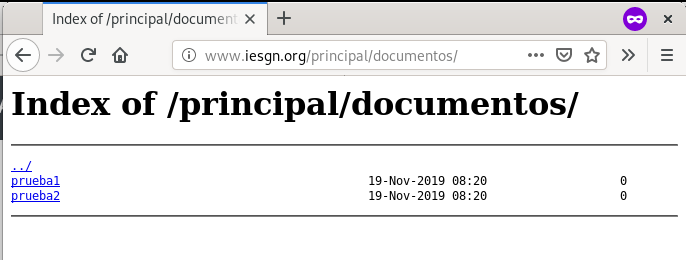

A continuación creamos un par de enlaces simbólicos, uno cuyo propietario del fichero es el usuario vagrant y el enlace es el usuario root y otro cuyo propietario del enlace y del fichero es el root
~~~
vagrant@servidornginx:/srv/doc$ touch /home/vagrant/ficheroVagrant.txt
vagrant@servidornginx:/srv/doc$ sudo ln -s /home/vagrant/ficheroVagrant.txt /srv/doc/
vagrant@servidornginx:/srv/doc$ sudo touch /home/vagrant/ficheroRoot.txt
vagrant@servidornginx:~$ sudo ln -s /home/vagrant/ficheroRoot.txt /srv/doc/
~~~

Se comprueba que el fichero que coincide el usuario del enlace simbólico y el propietario del fichero se puede ver.
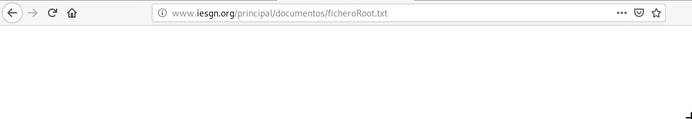

Y el fichero cuyos propietarios del enlace y del fichero son diferentes no aparece.
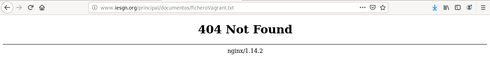

**Tarea 5: En todo el host virtual se debe redefinir los mensajes de error de objeto no encontrado y no permitido. Para el ello se crearan dos ficheros html dentro del directorio error. Entrega las modificaciones necesarias en la configuración y una comprobación del buen funcionamiento.**

Se crea un directorio donde guardar los html de los errores:
~~~
vagrant@servidornginx:~$ sudo mkdir /srv/www/iesgn/error
vagrant@servidornginx:~$ sudo touch /srv/www/iesgn/error/403.html
vagrant@servidornginx:~$ sudo touch /srv/www/iesgn/error/404.html
vagrant@servidornginx:~$ sudo chown -R www-data:www-data /srv/www/iesgn/error/
~~~

Se modifica el fichero /etc/nginx/sites-available/iesgn y se añaden las líneas de errores:
~~~
        error_page 404 /error/404.html;
                location /error/404.html {
                        internal;
                }

        error_page 403 /error/403.html;
                location /error/403.html {
                        internal;
                }
~~~

Se usa el fichero del ejercicio anterior para ver si funciona correctamente el error 404:
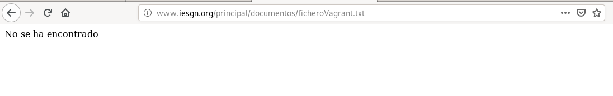

## Autentificación, Autorización, y Control de Acceso

**Tarea 6: Añade al escenario Vagrant otra máquina conectada por una red interna al servidor. A la URL departamentos.iesgn.org/intranet sólo se debe tener acceso desde el cliente de la red local, y no se pueda acceder desde la anfitriona por la red pública. A la URL departamentos.iesgn.org/internet, sin embargo, sólo se debe tener acceso desde la anfitriona por la red pública, y no desde la red local.**

Se crean los directorios correspondientes:
~~~
vagrant@servidornginx:~$ sudo mkdir /srv/www/departamentos/internet
vagrant@servidornginx:~$ sudo mkdir /srv/www/departamentos/intranet
vagrant@servidornginx:~$ sudo chown -R www-data:www-data /srv/www/departamentos/
~~~

Se añaden las reglas para internet e intranet en /etc/nginx/sites-available/departamentos:
~~~
server {
        listen 80;
        listen [::]:80;

        root /srv/www/departamentos;

        index index.html index.htm index.nginx-debian.html;

        server_name departamentos.iesgn.org;

        location / {
                try_files $uri $uri/ =404;
        }
        location /internet {
                deny 192.168.100.0/24;
                allow all;
        }

        location /intranet {
                allow 192.168.100.0/24;
                deny all;
        }
}
~~~

Tras reiniciar el servicio se comprueba. En primer lugar, internet, desde la máquina anfitriona, debe funcionar:
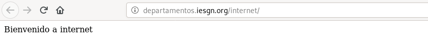

Sin embargo, la intranet no funciona:
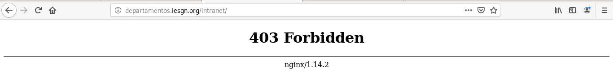

En la máquina conectada a la intranet, al acceder a internet, a través de lynx porque no dispone de interfaz gráfica, aparece el siguiente error:
~~~
                                                             403 Forbidden
                             403 Forbidden
     ____________________________________________________________

                             nginx/1.14.2

~~~

Y si se accede a intranet:
~~~

   Bienvenido a la intranet

~~~

**Tarea 7: Autentificación básica. Limita el acceso a la URL departamentos.iesgn.org/secreto. Comprueba las cabeceras de los mensajes HTTP que se intercambian entre el servidor y el cliente. ¿Cómo se manda la contraseña entre el cliente y el servidor?. Entrega una breve explicación del ejercicio.**

Para este ejercicio hay que instalar algunos paquetes que son herramientas de apache:
~~~
vagrant@servidornginx:/srv/www/departamentos$ sudo apt install apache2-utils 
~~~

Se crea el nuevo directorio secreto:
~~~
vagrant@servidornginx:/srv/www/departamentos$ sudo mkdir secreto
vagrant@servidornginx:/srv/www/departamentos$ sudo nano secreto/index.html
~~~

El fichero /etc/nginx/sites-available/departamentos se añade la configuración restringida de /secreto:
~~~
        location /secreto {
                auth_basic "Contenido secreto";
                auth_basic_user_file /etc/nginx/.htpasswd;
        } 
~~~

A continuación, se añade el usuario, en este caso vagrant, al fichero /etc/nginx/.htpasswd que se menciona en el paso anterior. Con el siguiente comando se crea el fichero además de agregarse el usuario.
~~~
vagrant@servidornginx:~$ sudo htpasswd -c -m /etc/nginx/.htpasswd vagrant
New password: 
Re-type new password: 
Adding password for user vagrant
~~~

Comprobación:
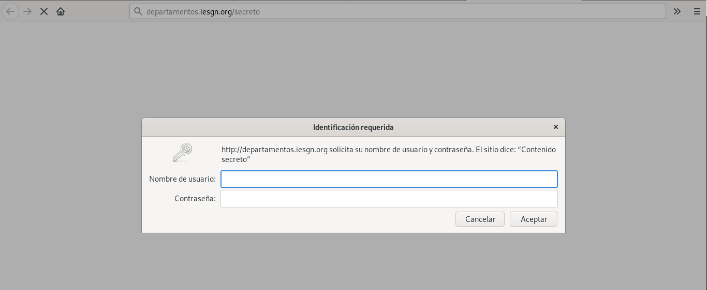

Introduciendo el usuario y la contraseña correcta podemos acceder al sitio:
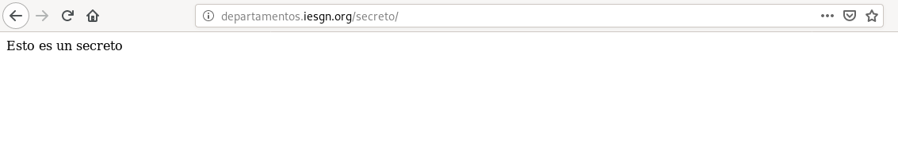

**Tarea 8: Cómo hemos visto la autentificación básica no es segura, modifica la autentificación para que sea del tipo digest, y sólo sea accesible a los usuarios pertenecientes al grupo directivos. Comprueba las cabeceras de los mensajes HTTP que se intercambian entre el servidor y el cliente. ¿Cómo funciona esta autentificación?**

**Tarea 9 (1 punto): Vamos a combinar el control de acceso (tarea 6) y la autentificación (tareas 7 y 8), y vamos a configurar el virtual host para que se comporte de la siguiente manera: el acceso a la URL departamentos.iesgn.org/secreto se hace forma directa desde la intranet, desde la red pública te pide la autentificación. Muestra el resultado al profesor.**

# IPv6

**Tarea 10 (1 punto): Comprueba que el servidor web con la configuración por defecto está escuchando por el puerto 80 en ipv6. Configura la máquina para que tenga una ipv6 global. Activa el virtualhost por defecto y accede a la página principal utilizando la ipv6 global que tiene asignada.**

**Tarea 11 (1 punto): Configura la resolución estática para acceder a los virtualhost utilizando ipv6.**

